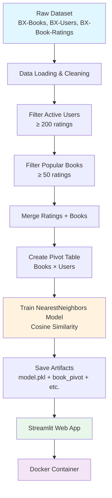

# 📚 Books Recommendation System

A Book Recommendation System built using **Item-Based Collaborative Filtering** with `NearestNeighbors` and cosine similarity, served through a Streamlit web application and fully containerized with Docker.

## 🚀 Project Pipeline



## 🔍 How the Recommendation Works

The system uses **item-based collaborative filtering** to find books that are similar to a book selected by the user.


### Recommendation Process

1. The user selects a book from the Streamlit application.

2. The system retrieves the selected book's vector from the pivot table.

3. `NearestNeighbors` calculates the nearest books using cosine distance.

4. The system returns the **Top 5** similar books.

5. Book cover images are displayed alongside the recommendations.

## ✨ Features

- 📖 Item-Based Collaborative Filtering

- 🔍 Cosine Similarity

- 🤖 NearestNeighbors with brute-force search

- 🖼️ Book cover images

- 🎨 Clean and interactive Streamlit interface

- 🐳 Fully containerized with Docker

- 📦 Pre-trained model and artifacts

- 🚀 Ready for deployment

## 🛠️ Tech Stack

| Technology          | Purpose                                      |

|---------------------|----------------------------------------------|

| Python 3.11         | Core programming language                    |

| Pandas              | Data loading and manipulation                |

| NumPy               | Numerical operations                         |

| Scikit-learn        | NearestNeighbors and similarity calculations |

| Streamlit           | Web application                              |

| Docker              | Containerization                             |

| Jupyter Notebook    | Model development and experimentation        |

## 📂 Project Structure

```text

books-recommender/

│

├── artifacts/

│   ├── model.pkl

│   ├── book_pivot.pkl

│   ├── books.pkl

│   └── ...

│

├── data/

│   ├── BX-Books.csv

│   ├── BX-Users.csv

│   └── BX-Book-Ratings.csv

│

├── notebooks/

│   └── model_training.ipynb

│

├── app.py

├── Dockerfile

├── requirements.txt

└── README.md

```

## ⚙️ Data Processing

The original **Book-Crossing** dataset contains books, users, and book ratings.  

The dataset is processed through several filtering steps to improve recommendation quality.

### 1. Filter Active Users

Users with fewer than **200 ratings** are removed.  

This helps ensure that the recommendation model is trained using users who have provided enough information about their reading preferences.

### 2. Filter Popular Books

Books with fewer than **50 ratings** are removed.  

This reduces noise and ensures that recommendations are based on books with sufficient rating data.

### 3. Create the Pivot Table

The cleaned ratings are transformed into a **Books × Users** matrix.

```text

                User 1   User 2   User 3   User 4

Book A             5        0        4        0

Book B             0        4        0        5

Book C             3        0        5        0

Book D             0        5        0        4

```

Each row represents a book, while each column represents a user.

## 🧠 Recommendation Algorithm

The recommendation model uses `NearestNeighbors` from scikit-learn with **cosine distance**.

Conceptually:

```text

Selected Book

      │

      ▼

Book Vector

      │

      ▼

NearestNeighbors

      │

      ▼

Cosine Distance

      │

      ▼

Most Similar Books

      │

      ▼

Top 5 Recommendations

```

Books with similar user-rating patterns are considered similar.

## 💻 Run Locally

### 1. Clone the Repository

```bash

git clone <your-repository-url>

cd books-recommender

```

### 2. Create a Virtual Environment

Using `uv`:

```bash

uv venv

```

Activate the environment:

**Windows:**

```powershell

.venv\Scripts\activate

```

**macOS / Linux:**

```bash

source .venv/bin/activate

```

### 3. Install Dependencies

```bash

uv pip install -r requirements.txt

```

### 4. Run the Streamlit Application

```bash

streamlit run app.py

```

The application will be available at:

```text

http://localhost:8501

```

## 🐳 Run with Docker

### Build the Docker Image

```bash

docker build -t books-recommender .

```

### Run the Container

```bash

docker run -p 8501:8501 books-recommender

```

Then open:

```text

http://localhost:8501

```

## 📊 Dataset

This project uses the **Book-Crossing Dataset**, which contains:

- Book information

- User information

- User ratings

The dataset is commonly used for experimenting with recommender systems and collaborative filtering.

## 🔮 Future Improvements

Possible improvements include:

- Add user-based collaborative filtering

- Add hybrid recommendations

- Add book search functionality

- Add genre-based filtering

- Add user rating functionality

- Improve recommendation ranking

- Add recommendation explanations

- Deploy the application to a cloud platform

- Add automated model retraining

- Add unit and integration tests

## 📌 Key Concepts

This project demonstrates practical implementation of:

- Collaborative Filtering

- Item-Based Recommendation

- Cosine Similarity

- Nearest Neighbors

- Data Cleaning

- Feature Engineering

- Pivot Tables

- Model Serialization

- Streamlit Application Development

- Docker Containerization

## 👨‍💻 Author

**Yash Paprikar**